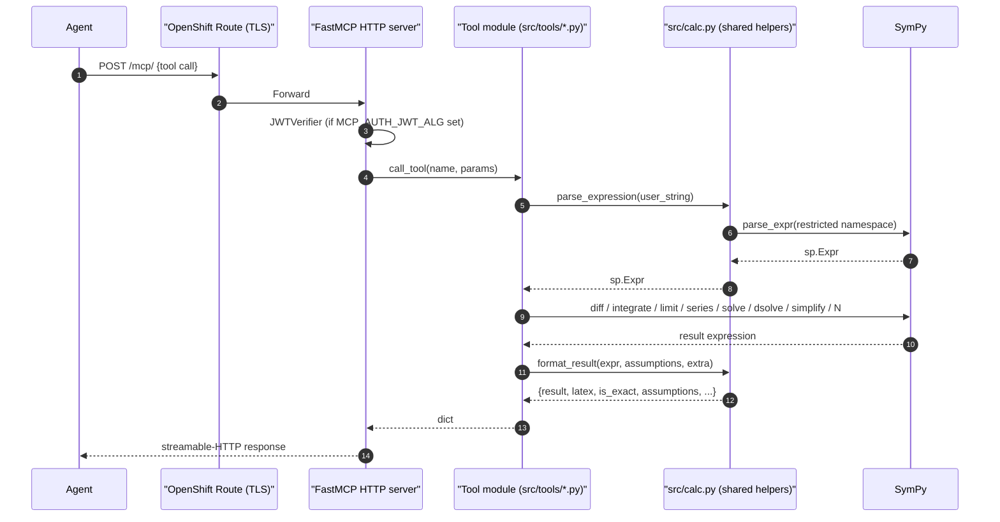
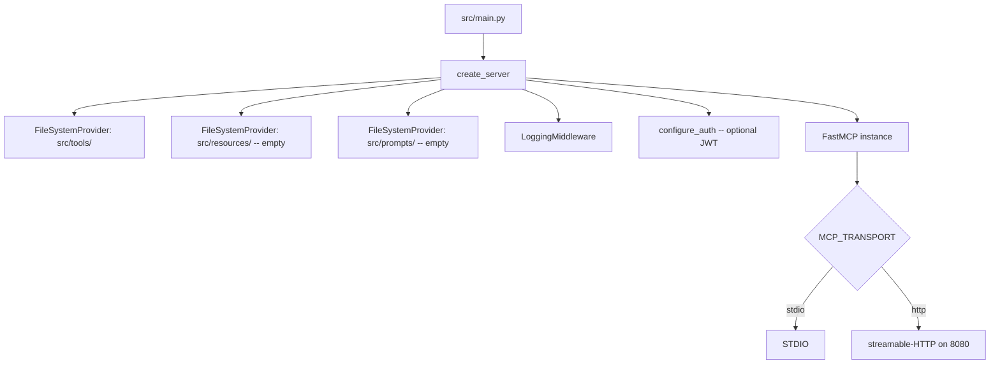

# Architecture

The calculus-helper MCP server is a thin, stateless FastMCP 3.x application built around [SymPy](https://www.sympy.org). Eight tools expose calculus operations (differentiation, integration, limits, series, equation and ODE solving, simplification, numerical evaluation) with a uniform return contract that lets agents chain tool outputs back into inputs without re-parsing.

## Component inventory

| Kind | Count | Files |
|---|---|---|
| Tools | 8 | `src/tools/{differentiate,integrate,evaluate_limit,taylor_series,solve_equation,solve_ode,simplify_expression,evaluate_numeric}.py` |
| Resources | 0 | — |
| Prompts | 0 | — |
| Custom middleware | 0 | — (FastMCP's built-in `LoggingMiddleware` is configured in `src/core/server.py`) |

No server-side state is held between calls. Each tool is a pure function of its inputs plus SymPy.

## Request flow



## The `src/calc.py` shared layer

All eight tools delegate their cross-cutting concerns to one module so behaviour stays uniform:

- **`parse_expression(str, context=...)`** — the single entry point for turning an untrusted string into a `sp.Expr`. Uses a restricted whitelist namespace (trig, hyperbolic, exp/log, roots, `erf`, `gamma`, `factorial`, constants `pi`/`E`/`oo`, plus inverse-trig `arcsin`/`arctan`/... and base-specific logs `log10`/`log2`). Arbitrary Python `eval` is not reachable.
- **`parse_symbol(str, context=...)`** — a stricter parser for bare identifiers (variable names). Rejects expressions.
- **`parse_substitutions(dict, context=...)`** — `{name: value_expr}` pairs, with both sides routed through the strict parsers.
- **`format_result(expr, assumptions, extra)`** — builds the standard return dict (`result` / `latex` / `is_exact` / `assumptions`), with optional `extra` keys for tools that return sets (`solve_equation`) or per-term coefficients (`taylor_series`).
- **`is_exact(expr)`** — heuristic: `True` iff the expression contains no `sp.Float`.

### Parser design note: `split_symbols` is deliberately excluded

SymPy's `implicit_multiplication_application` transformer bundles three rewrites: implicit multiplication (`2x → 2*x`), implicit function application, and **`split_symbols`** — which fractures multi-letter identifiers into products of single letters.

`split_symbols` turns `log10(x)` into `l*o*g*10*x` and `arcsin(x)` into `a*c*i*n*r*s*x`, silently producing expressions the user never wrote. `src/calc.py` therefore uses `implicit_multiplication + implicit_application` without `split_symbols`, and adds `log10`, `log2`, `arcsin`, `arccos`, `arctan` (and hyperbolic inverses) to the whitelist so the common names resolve correctly. The tradeoff: `xy` is parsed as a single `Symbol("xy")` rather than `x*y`. Users write `x*y` explicitly instead.

## Error contract

Every user-facing failure is raised as `fastmcp.exceptions.ToolError` with a coaching message that states what went wrong *and* how to fix it. Examples:

- Unbalanced parentheses → `"Could not parse expression: '...'. Parser said: ...  Check for balanced parentheses. Use '**' for exponents, ..."`
- `^` for exponent → `"Use '**' for exponents, not '^'. In Python/SymPy '^' is bitwise XOR and silently produces wrong answers on integer inputs (2^3 = 1, not 8)."`
- `solve_equation` can't find a closed form → `"SymPy couldn't find a closed form. Re-call with `numerical_near` set to an approximate value near the root you want."`
- ODE outside SymPy's solvable classes → tells the agent to try simplification, a series solution via `taylor_series`, or (acknowledges) numerical methods aren't provided.

The intent is that an agent reading the error can self-correct without a human intervention.

## Return contract (detail)

```python
{
    "result": str,          # SymPy string form, re-parseable via parse_expression
    "latex": str,           # for display
    "is_exact": bool,       # True for symbolic/exact, False for Float approximation
    "assumptions": list[str],  # Notes surfaced to user (constants omitted,
                               # singularities, directions disregarded, etc.)
}
```

Extensions:
- `solve_equation`: `solutions` (list[str]), `solutions_latex` (list[str]), `count` (int, `-1` for infinite family).
- `taylor_series`: `coefficients` (list[str]) for powers `0..order-1`.
- `evaluate_numeric`: `exact_form` (str) — the post-substitution symbolic form before `sp.N`.

## Bootstrap



`FileSystemProvider` discovers tools by scanning `src/tools/` for modules with `@tool`-decorated functions. With `MCP_HOT_RELOAD=1` it watches for file changes.

`src/calc.py` is intentionally at `src/` (not `src/tools/`) so the scanner never tries to import it as a tool module.

## Deployment


`make deploy PROJECT=<ns>` runs `deploy.sh`, which creates the namespace if missing, applies `openshift.yaml` (ImageStream + BuildConfig + Deployment + Service + Route), and triggers a binary build from the local working tree. Because the cluster handles the build, local podman / platform architecture mismatches are irrelevant.

The deployed server runs with `MCP_TRANSPORT=http` on port 8080 inside the pod. The Route exposes `https://<host>/mcp/` externally with TLS termination at the edge.

## Dependencies

| Package | Role |
|---|---|
| `sympy>=1.13` | The engine. Symbolic calculus, arbitrary-precision numerics (via bundled `mpmath`), LaTeX printing, ODE solving. |
| `fastmcp>=3.2.0` | MCP server framework (providers, decorators, transports, auth). |
| `python-dotenv`, `pyyaml`, `jinja2` | Config and scaffolding generator support (from the template base). |
| `pytest`, `pytest-asyncio` | Test runner. |

No external APIs, no databases, no network egress. The pod only needs cluster-internal image pulls and whatever ingress the Route carries.

## Testing strategy

- **Unit**: `tests/tools/test_*.py` — one file per tool, covering happy path, parse errors, and each tool's tricky edge case (singularities for `taylor_series`, divergence for `integrate`, one-sided limit disagreement for `evaluate_limit`, etc.). 74 tests.
- **End-to-end**: `tests/test_server_e2e.py` — spins up the real `FastMCP` server via `Client` (both in-process and streamable-HTTP), verifies the 8 expected tools are discovered, and round-trips two calls through the client API. 13 tests (the 8-way parameterized discovery test + 5 others).
- **Auth / server infrastructure**: `tests/test_auth*.py`, `tests/test_server.py` — inherited from the FastMCP template, verify the bootstrap and JWT auth paths still wire up correctly.
- **Regression guards**: two tests in `tests/tools/test_evaluate_numeric.py` and `tests/tools/test_solve_ode.py` specifically lock in fixes for silent correctness bugs (the `log10` mangling and the IC-function-name mismatch).

Total: 105 tests, all passing.

## Key design decisions

1. **Strings in, dict out.** Math flows as Python/SymPy syntax strings — the cheapest serialization for an LLM. Results always come back as structured dicts rather than bare strings, so agents never have to guess what's exact vs approximate.
2. **Shared parsing / formatting.** All eight tools route through `src/calc.py`. Without this, each subagent implementing a tool would invent slightly different error messages and subtly different return shapes.
3. **Coaching errors over strict validation.** Every `ToolError` tells the agent *how to fix it*, not just *what failed*. Errors are recovery instructions.
4. **Dual output (SymPy + LaTeX) always.** Rather than an `include_latex` flag, every response carries both. Agents can display LaTeX and chain SymPy without a second round-trip.
5. **No pedagogical step-by-step output.** SymPy doesn't natively produce human-readable solution steps. Agents narrate the pedagogy; this server only computes.
6. **Statelessness.** No session, no caching between calls. Scales horizontally by pod count; idempotent by construction.
